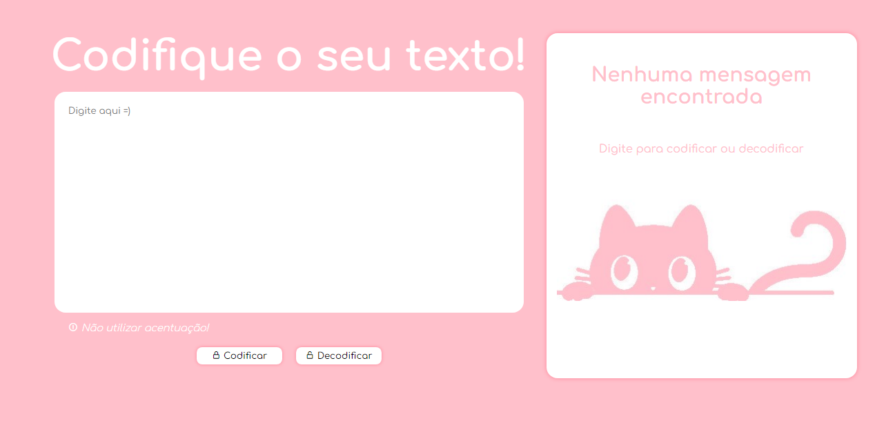
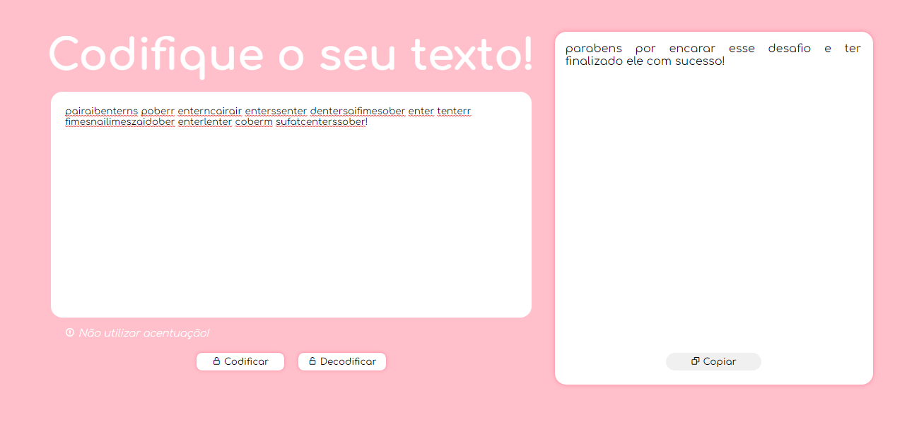
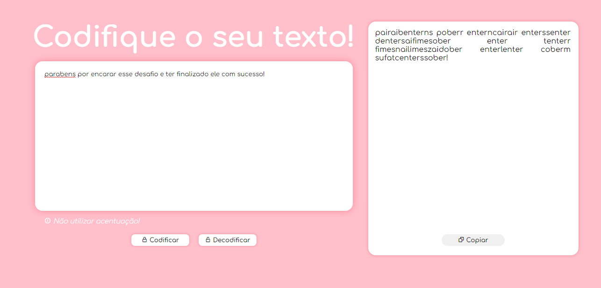

<h1> :computer: Desafio 1 - ONE / Decodificador de Texto </h1>

<h2> :mag_right: Descrição do Desafio </h2>

Fui desafiado a desenvolver um decodificador de texto com Javascript onde o usuário pudesse escrever e ler mensagens secretas!

As "chaves" de criptografia que utilizei foram:

<ul>
  <li>a = ai; </li>
  <li>e = enter;</li>
  <li>i = imes;</li>
  <li>o = ober;</li>
  <li>u = ufat.</li>
</ul>

<h1> :arrow_right: Layout da Página: </h1>

<h1><strong> :arrow_right: Exemplo de mensagem secreta: </strong></h1>

Requisitos do desafio: 
<ul>
  <li>Deve funcionar apenas com letras minúsculas</li>
  <li>Não devem ser utilizados letras com acentos nem caracteres especiais</li>
  <li>Deve ser possível converter uma palavra para a versão criptografada e também retornar uma palavra criptografada para a versão original.</li>
</ul>
  <ul>
  Por exemplo:
  <li>"gato" => "gaitober"</li>
  <li>gaitober" => "gato"</li>
  </ul>
A página deve ter campos para inserção do texto a ser criptografado ou descriptografado, e a pessoa usuária deve poder escolher entre as duas opções
O resultado deve ser exibido na tela.

<strong> :next_track_button: Extras:
<ul><li>Um botão que copie o texto criptografado/descriptografado para a área de transferência - ou seja, que tenha a mesma funcionalidade do ctrl+C ou da opção "copiar" do menu dos aplicativos.</li></ul></strong>

<h1><strong> :arrow_right: Outro exemplo de mensagem secreta: </strong></h1>

<h1><strong> :arrow_right: Você pode acessar a página do Projeto através do GitHub Pages.</h1>

https://cardosomath.github.io/decodificador-One/
